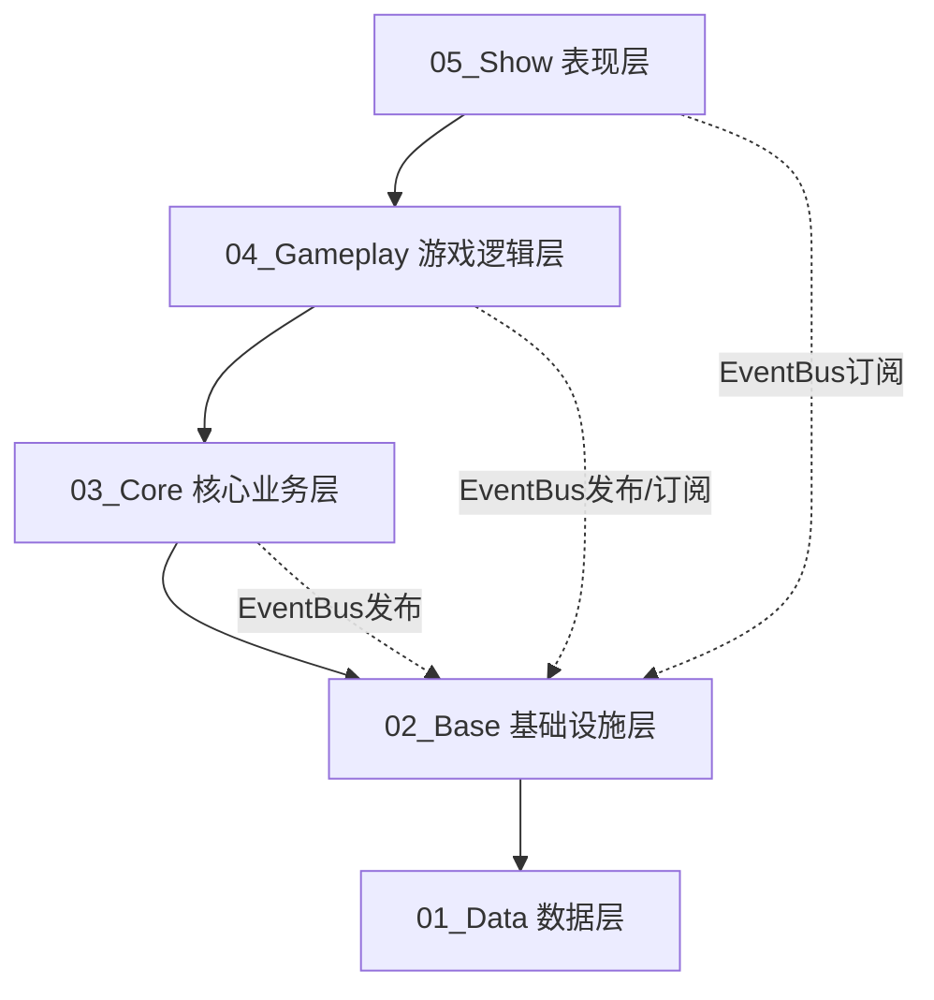
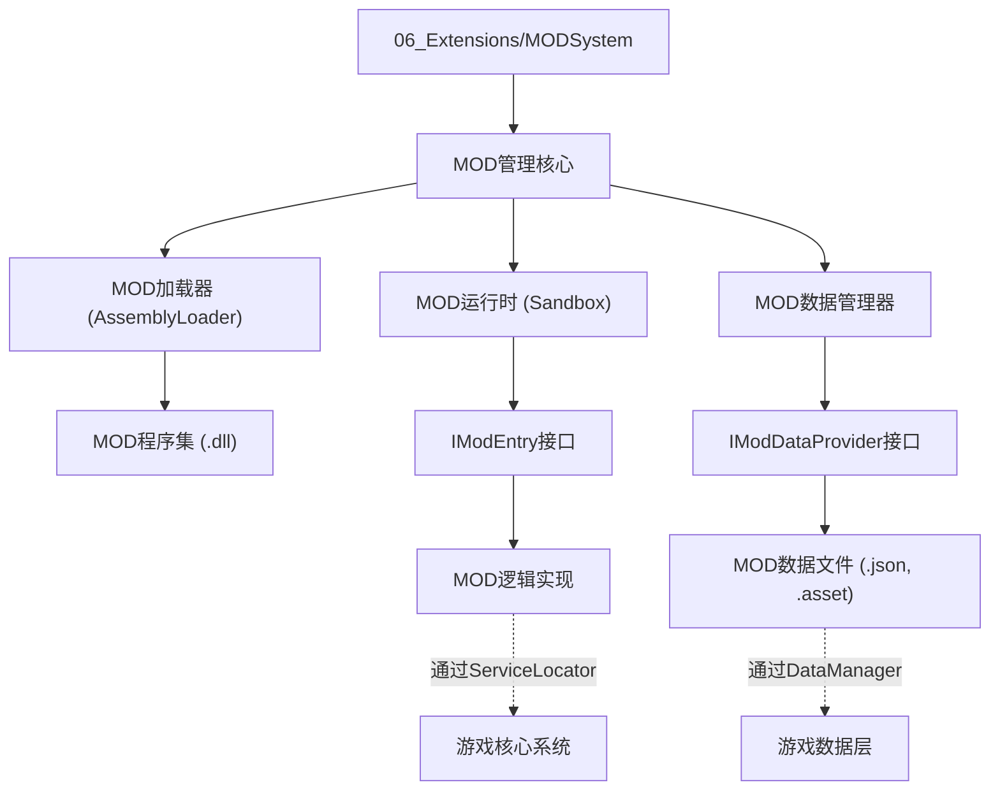

# 《根与废土》Roots & Ruin - 代码编写规范 v1.0

## 概述

本文档规定了《根与废土》Unity项目的代码编写标准，旨在确保：
1. **高效与解耦**：代码性能优化，模块间低耦合
2. **设计模式合理**：在合适的地方使用合适的设计模式
3. **优秀可扩展性**：易于添加新功能，支持MOD扩展
4. **架构一致性**：严格遵守五层菱形分层架构
5. **策划驱动**：代码实现与策划需求对齐

---

## 第一章：架构遵守原则

### 1.1 五层菱形分层架构要求

项目采用**强制数字前缀目录**分层，依赖方向单向向下：



#### **禁止的依赖关系**：
- ❌ `01_Data` 引用任何上层代码
- ❌ `02_Base` 包含业务逻辑
- ❌ `03_Core` 直接操作UI控件
- ❌ `04_Gameplay` 直接读写UI控件
- ❌ `05_Show` 包含任何业务规则

#### **文件位置规则**：
```csharp
// ✅ 正确示例
Assets/_Game/Scripts/03_Core/SurvivalStatus/SurvivalStatusSystem.cs

// ❌ 错误示例
Assets/_Game/Scripts/SurvivalStatusSystem.cs  // 缺少层级目录前缀
```

### 1.2 通信规范

| 通信方向 | 允许方式 | 禁止方式 |
|---------|---------|---------|
| **逻辑层→业务层** | `ServiceLocator.Get<T>()` | 直接`new`或单例引用 |
| **业务层→表现层** | `EventBus.Publish<T>()` | 直接调用UI方法 |
| **表现层→业务层** | `ServiceLocator.Get<T>()` + 调用<br>`EventBus.Publish<UIEvent>()` | 持有业务层引用 |
| **跨业务层通信** | `EventBus.Publish<T>()` | 直接相互引用 |

### 1.3 核心基础设施使用

#### **ServiceLocator** - 替代全局单例
```csharp
// ✅ 正确：核心系统注册
public class SurvivalStatusSystem : MonoBehaviour, ISaveable
{
    private void Awake()
    {
        ServiceLocator.Register<SurvivalStatusSystem>(this);
    }
}

// ✅ 正确：其他系统获取服务
var survivalSystem = ServiceLocator.Get<SurvivalStatusSystem>();
```

#### **MonoSingleton** - 仅用于基础设施管理器
```csharp
// ✅ 正确：AudioManager继承MonoSingleton
public class AudioManager : MonoSingleton<AudioManager> { }

// ❌ 错误：业务系统继承MonoSingleton
public class InventorySystem : MonoSingleton<InventorySystem> { }  // 应使用ServiceLocator
```

### 1.4 事件总线使用规范

#### **事件定义要求**：
1. 所有事件必须是**结构体**（避免GC）
2. 实现`IEvent`标记接口
3. 按模块分组文件（`InventoryEvents.cs`, `CombatEvents.cs`）

```csharp
// ✅ 正确：结构体事件
public struct ItemAddedToInventoryEvent : IEvent
{
    public string ItemId;
    public int Amount;
    public int SlotIndex;
}

// ❌ 错误：类事件（会产生GC）
public class ItemAddedToInventoryEvent : IEvent { }
```

#### **订阅与清理**：
```csharp
public class InventoryPresenter : MonoBehaviour
{
    private void OnEnable()
    {
        EventBus.Subscribe<ItemAddedToInventoryEvent>(OnItemAdded);
    }

    private void OnDisable()
    {
        EventBus.Unsubscribe<ItemAddedToInventoryEvent>(OnItemAdded);
    }

    private void OnDestroy()
    {
        // OnDisable可能被跳过，OnDestroy确保清理
        EventBus.Unsubscribe<ItemAddedToInventoryEvent>(OnItemAdded);
    }
}
```

### 1.5 计时器系统使用

禁止使用Unity的`Invoke`，必须使用`TimerSystem`：

```csharp
// ✅ 正确：使用TimerSystem
TimerSystem.Instance.Create(() =>
{
    // 逻辑代码
}, delaySeconds);

// ❌ 错误：使用Invoke
Invoke("SomeMethod", delaySeconds);
```

---

## 第二章：设计模式使用指南

### 2.1 策略模式（Strategy Pattern）

**适用场景**：算法或行为可变，需要运行时切换

**示例实现**：伤害计算器
```csharp
// 02_Base/Combat/IDamageCalculator.cs
public interface IDamageCalculator
{
    float CalculateDamage(AttackData attack, DefenseData defense);
}

// 04_Gameplay/Combat/Calculators/
public class PhysicalDamageCalculator : IDamageCalculator { }
public class ElementalDamageCalculator : IDamageCalculator { }
public class CriticalDamageCalculator : IDamageCalculator { }

// 战斗系统使用
public class CombatSystem
{
    private IDamageCalculator _damageCalculator;

    public void SetDamageCalculator(IDamageCalculator calculator)
    {
        _damageCalculator = calculator;
    }
}
```

### 2.2 状态模式（State Pattern）

**适用场景**：对象行为随状态改变，状态数量有限

**示例实现**：玩家状态机
```csharp
// 使用通用StateMachine框架
public class PlayerStateMachine : StateMachine<PlayerState>
{
    public PlayerStateMachine()
    {
        AddState(PlayerState.Idle, new PlayerIdleState());
        AddState(PlayerState.Move, new PlayerMoveState());
        AddState(PlayerState.Attack, new PlayerAttackState());
    }
}

// 状态实现
public class PlayerIdleState : IState
{
    public void OnEnter() { /* 播放待机动画 */ }
    public void OnUpdate(float deltaTime) { /* 检测输入 */ }
    public void OnExit() { /* 清理 */ }
}
```

### 2.3 观察者模式（Observer Pattern）

**已通过EventBus实现**，禁止自行实现观察者：

```csharp
// ✅ 正确：使用EventBus
EventBus.Publish(new PlayerHealthChangedEvent { Delta = -10 });

// ❌ 错误：自定义观察者
public class PlayerHealth
{
    public event Action<float> OnHealthChanged;  // 不要这样做
}
```

### 2.4 工厂模式（Factory Pattern）

**适用场景**：复杂对象创建，创建逻辑可能变化

**示例实现**：敌人创建工厂
```csharp
// 04_Gameplay/Enemy/EnemyFactory.cs
public class EnemyFactory
{
    public EnemyBase CreateEnemy(EnemyType type, Vector3 position)
    {
        var definition = GetEnemyDefinition(type);
        var enemy = ObjectPoolManager.Get<EnemyBase>();
        enemy.Initialize(definition);
        enemy.transform.position = position;
        return enemy;
    }
}
```

### 2.5 命令模式（Command Pattern）

**适用场景**：需要撤销/重做，或异步执行的操作

**示例实现**：建造命令
```csharp
// 02_Base/CommandSystem/
public interface ICommand
{
    void Execute();
    void Undo();
}

public class BuildStructureCommand : ICommand
{
    private StructureType _type;
    private Vector3 _position;
    private Structure _builtStructure;

    public void Execute()
    {
        _builtStructure = StructureFactory.Create(_type, _position);
    }

    public void Undo()
    {
        if (_builtStructure != null)
            ObjectPoolManager.Release(_builtStructure.gameObject);
    }
}
```

### 2.6 数据驱动设计（Data-Driven Design）

**核心原则**：尽可能使用ScriptableObject，代码为框架，数据定义行为

**扩展点表格**：

| 扩展类型 | 实现方式 | 需修改文件数 |
|---------|---------|-------------|
| 新增物品 | 创建 `.asset` + 可选子类 | 0-1 |
| 新增配方 | 创建 `RecipeDefinitionSO.asset` | 0 |
| 新增敌人 | 继承`EnemyBase` + 创建`.asset` | 1 |
| 新增状态效果 | 实现`IStatusEffect` | 1 |
| 新增玩家状态 | 实现`IState` + 注册 | 1 |

---

## 第三章：代码风格与约定

### 3.1 文件头部注释规范

**每个C#文件必须包含标准头部注释**：

```csharp
// 📁 03_Core/SurvivalStatus/SurvivalStatusSystem.cs
// Unity 2D生存游戏《根与废土》- 生存属性系统
// 作者：XXX
// 创建时间：2026-03-25
// 最后修改：2026-03-25
//
// 🏗️ 架构层级：03_Core - 核心业务层
// ⚙️ 职责：统一管理玩家所有生存属性（血量/饥饿/口渴/体温/疾病）
// 📡 依赖：EventBus, SurvivalConfigSO, IStatusEffect
// 📤 发布：SurvivalAttributeChangedEvent, PlayerDeadEvent
//
// 💡 设计说明：
// 1. 使用TimerSystem进行属性衰减，避免Update中的GC分配
// 2. 支持状态效果的挂载与自动Tick
// 3. 属性归零时触发相应后果事件
// 4. 实现ISaveable支持存档
//
// [PERF] 优化标记：
// - 使用结构体事件避免GC
// - 使用对象池管理ActiveStatusEffect
// - Update中避免字符串拼接

using UnityEngine;
using System.Collections.Generic;
```

**头部注释字段说明**：
- `📁 文件路径`：相对_Game/Scripts的路径
- `🏗️ 架构层级`：明确所属分层
- `⚙️ 职责`：单一明确职责描述
- `📡 依赖`：依赖的核心系统/接口
- `📤 发布`：发布的事件类型
- `💡 设计说明`：关键设计决策
- `[PERF] 优化标记`：性能关键代码标记

### 3.2 命名约定

#### **类与接口命名**：
```csharp
// ✅ 正确
public class InventorySystem { }          // 系统类：名词 + System
public interface IStatusEffect { }        // 接口：I + 名词
public struct ItemAddedEvent : IEvent { } // 事件：名词 + Event
public abstract class ItemDefinitionSO { } // SO基类：名词 + DefinitionSO
public class ZombieEnemy : EnemyBase { }  // 具体实现：特征 + 基类名
```

#### **方法命名**：
```csharp
// ✅ 动作性方法使用动词开头
public void AddItem(string itemId, int amount) { }
public bool TryConsumeItem(string itemId, int amount) { }
public ItemStack GetItemAtSlot(int slotIndex) { }

// ✅ 查询性方法使用Get/Find/Calculate等
public float CalculateTotalWeight() { }
public bool HasItem(string itemId) { }
```

#### **变量命名**：
```csharp
// ✅ 私有字段：_camelCase
private int _currentHealth;
private List<ItemStack> _inventorySlots;

// ✅ 公有属性/字段：PascalCase
public int MaxHealth { get; private set; }
public string PlayerName { get; set; }

// ✅ 常量：ALL_CAPS
public const int MAX_INVENTORY_SLOTS = 30;
public const string DEFAULT_SAVE_FOLDER = "Saves";
```

#### **事件相关命名**：
```csharp
// 事件结构体：名词 + Event
public struct PlayerHealthChangedEvent : IEvent { }

// 事件处理方法：On + 事件名
private void OnPlayerHealthChanged(PlayerHealthChangedEvent evt) { }

// 事件发布：Publish + 事件实例
EventBus.Publish(new PlayerHealthChangedEvent { Delta = -10 });
```

### 3.3 注释规范

#### **XML文档注释**（公共API必须）：
```csharp
/// <summary>
/// 向背包添加物品。
/// </summary>
/// <param name="itemId">物品ID，对应ItemDefinitionSO.ItemId</param>
/// <param name="amount">添加数量，必须大于0</param>
/// <returns>成功添加返回true，背包已满返回false</returns>
/// <exception cref="ArgumentException">当itemId为空或amount≤0时抛出</exception>
/// <remarks>
/// 此方法会触发ItemAddedToInventoryEvent事件。
/// 对于堆叠物品，会自动合并到已有堆叠中。
/// </remarks>
public bool TryAddItem(string itemId, int amount) { }
```

#### **行内注释**：
```csharp
// ❌ 错误：注释废话
int health = 100; // 设置血量为100

// ✅ 正确：注释解释"为什么"
int health = 100; // 初始血量，参考策划文档"角色基础数值表"
```

#### **[PERF] 性能注释**：
```csharp
// [PERF] 使用结构体避免GC分配
public struct DamageEvent : IEvent { }

// [PERF] 对象池重用，避免Instantiate/Destroy
var bullet = ObjectPoolManager.Get<Bullet>();

// [PERF] 预计算，避免重复计算
private float _cachedDamageMultiplier;
```

### 3.4 访问修饰符原则

**严格遵循最小权限原则**：

```csharp
public class InventorySystem
{
    // ✅ 正确：私有字段，通过属性暴露
    private List<ItemStack> _slots;
    public IReadOnlyList<ItemStack> Slots => _slots.AsReadOnly();

    // ✅ 正确：内部使用的辅助方法设为private
    private int FindEmptySlot() { }

    // ✅ 正确：子类可重写的方法设为protected virtual
    protected virtual bool CanAddToStack(ItemStack stack, string itemId, int amount) { }

    // ❌ 错误：公开内部集合
    public List<ItemStack> InventorySlots;  // 外部可直接修改！

    // ❌ 错误：应私有化的方法设为public
    public void InternalRecalculateWeight() { }  // 应是private
}
```

### 3.5 Unity特定规范

#### **MonoBehaviour生命周期**：
```csharp
public class PlayerController : MonoBehaviour
{
    // ✅ 正确：Awake用于初始化内部状态
    private void Awake()
    {
        _rigidbody = GetComponent<Rigidbody2D>();
        ServiceLocator.Register<PlayerController>(this);
    }

    // ✅ 正确：Start用于初始化依赖其他对象的状态
    private void Start()
    {
        _inventory = ServiceLocator.Get<InventorySystem>();
    }

    // ✅ 正确：OnEnable/OnDisable管理事件订阅
    private void OnEnable()
    {
        EventBus.Subscribe<GamePausedEvent>(OnGamePaused);
    }

    private void OnDisable()
    {
        EventBus.Unsubscribe<GamePausedEvent>(OnGamePaused);
    }

    // ✅ 正确：Update用于输入检测，FixedUpdate用于物理
    private void Update() { /* 处理输入 */ }
    private void FixedUpdate() { /* 物理移动 */ }
}
```

#### **GetComponent缓存**：
```csharp
// ❌ 错误：每帧GetComponent
private void Update()
{
    var rigidbody = GetComponent<Rigidbody2D>();  // 性能开销！
    rigidbody.velocity = _moveDirection * _speed;
}

// ✅ 正确：Awake中缓存
private Rigidbody2D _rigidbody;

private void Awake()
{
    _rigidbody = GetComponent<Rigidbody2D>();
}

private void Update()
{
    _rigidbody.velocity = _moveDirection * _speed;  // 使用缓存引用
}
```

#### **协程使用规范**：
```csharp
// ✅ 正确：使用CancellationToken支持取消
private Coroutine _currentCoroutine;
private CancellationTokenSource _cancellationTokenSource;

public void StartAction()
{
    _cancellationTokenSource?.Cancel();
    _cancellationTokenSource = new CancellationTokenSource();
    _currentCoroutine = StartCoroutine(ActionCoroutine(_cancellationTokenSource.Token));
}

private IEnumerator ActionCoroutine(CancellationToken token)
{
    yield return new WaitForSeconds(1f);

    if (token.IsCancellationRequested)
        yield break;  // 安全退出

    // 继续执行...
}

public void CancelAction()
{
    _cancellationTokenSource?.Cancel();
    if (_currentCoroutine != null)
    {
        StopCoroutine(_currentCoroutine);
        _currentCoroutine = null;
    }
}
```

---

## 第四章：性能优化规范

### 4.1 GC（垃圾回收）优化

**核心原则**：避免不必要的堆内存分配，特别是每帧执行的代码中。

#### **4.1.1 事件系统零GC**
```csharp
// ✅ 正确：所有事件必须是结构体
public struct ItemAddedEvent : IEvent
{
    public string ItemId;  // 字符串无法避免，但事件发布频率低
    public int Amount;     // 值类型，无GC
}

// ❌ 错误：类事件会产生GC
public class ItemAddedEvent : IEvent { }  // 每次new都会在堆上分配
```

#### **4.1.2 避免装箱拆箱**
```csharp
// ❌ 错误：值类型装箱
object health = 100;  // 装箱，产生GC
int currentHealth = (int)health;  // 拆箱

// ✅ 正确：使用泛型避免装箱
public class ObjectPool<T> where T : new()
{
    private Queue<T> _pool = new Queue<T>();

    public T Get()
    {
        return _pool.Count > 0 ? _pool.Dequeue() : new T();  // 无装箱
    }
}
```

#### **4.1.3 字符串处理优化**
```csharp
// ❌ 错误：频繁字符串拼接
string message = "玩家 " + playerName + " 获得了 " + itemName;  // 产生中间字符串

// ✅ 正确：使用StringBuilder
StringBuilder sb = new StringBuilder();
sb.Append("玩家 ");
sb.Append(playerName);
sb.Append(" 获得了 ");
sb.Append(itemName);
string message = sb.ToString();

// ✅ 正确：使用nameof避免魔法字符串（编译时常量）
EventBus.Publish(new DebugLogEvent { Message = nameof(InventorySystem) + " initialized" });
```

### 4.2 对象池使用规范

**必须使用对象池的场景**：
1. 频繁创建销毁的物体（子弹、特效、敌人）
2. UI元素（血条、伤害数字）
3. 世界中的可拾取物品

#### **4.2.1 对象池集成**
```csharp
// 所有可池化对象实现IPoolable
public class Bullet : MonoBehaviour, IPoolable
{
    public void OnSpawn()
    {
        gameObject.SetActive(true);
        // 重置状态
    }

    public void OnDespawn()
    {
        gameObject.SetActive(false);
        // 清理状态
    }
}

// 使用对象池
var bullet = ObjectPoolManager.Get<Bullet>();
// ... 使用后
ObjectPoolManager.Release(bullet.gameObject);  // 不调用Destroy
```

#### **4.2.2 预加载策略**
```csharp
// 游戏启动时预加载常用对象
public class GameBootstrap : MonoBehaviour
{
    private void Awake()
    {
        // 预加载：减少运行时卡顿
        ObjectPoolManager.Preload<Bullet>(20);
        ObjectPoolManager.Preload<DamageNumber>(10);
        ObjectPoolManager.Preload<EnemyBase>(5);
    }
}
```

### 4.3 计时器系统规范

**禁止使用**：`Invoke`, `InvokeRepeating`, `Coroutine`中的`WaitForSeconds`（用于延迟）

**必须使用**：`TimerSystem`

```csharp
// ✅ 正确：使用TimerSystem
TimerHandle handle = TimerSystem.Instance.Create(() =>
{
    // 延迟执行逻辑
}, 2.0f);

// 可以控制计时器
handle.Pause();
handle.Resume();
handle.Cancel();

// ✅ 正确：循环计时器
TimerSystem.Instance.Create(() =>
{
    // 每5秒执行一次
}, 5.0f, loops: -1);  // -1表示无限循环

// ❌ 错误：使用Invoke
Invoke("DelayedMethod", 2.0f);
```

### 4.4 更新循环优化

#### **4.4.1 避免每帧GetComponent**
```csharp
// 所有组件引用在Awake/Start中缓存
private Rigidbody2D _rigidbody;
private Animator _animator;

private void Awake()
{
    _rigidbody = GetComponent<Rigidbody2D>();
    _animator = GetComponent<Animator>();
}
```

#### **4.4.2 按需更新**
```csharp
// 使用标志控制更新频率
public class TemperatureSystem : MonoBehaviour
{
    private float _updateTimer;
    private const float UPDATE_INTERVAL = 0.5f;  // 每0.5秒更新一次

    private void Update()
    {
        _updateTimer -= Time.deltaTime;
        if (_updateTimer <= 0f)
        {
            UpdateTemperature();
            _updateTimer = UPDATE_INTERVAL;
        }
    }
}
```

#### **4.4.3 使用Job System/Burst Compile（可选）**
```csharp
// 大量计算使用Jobs
public class PathfindingSystem : MonoBehaviour
{
    private NativeArray<Vector2> _positions;
    private NativeArray<float> _results;
    private JobHandle _jobHandle;

    private void Update()
    {
        _jobHandle.Complete();  // 等待上一帧Job完成

        var job = new CalculateDistancesJob
        {
            Positions = _positions,
            Results = _results
        };

        _jobHandle = job.Schedule(_positions.Length, 64);
    }
}
```

### 4.5 内存管理

#### **4.5.1 ScriptableObject引用管理**
```csharp
// ✅ 正确：使用Addressables异步加载
public class ResourceLoader
{
    public async Task<ItemDefinitionSO> LoadItemDefinition(string itemId)
    {
        var handle = Addressables.LoadAssetAsync<ItemDefinitionSO>($"Items/{itemId}");
        await handle.Task;
        return handle.Result;
    }
}

// ❌ 错误：Resources.Load同步加载（卡顿风险）
var item = Resources.Load<ItemDefinitionSO>($"Items/{itemId}");
```

#### **4.5.2 纹理与音频优化**
```csharp
// 纹理设置：
// - 压缩格式：ASTC/PVRTC/ETC2（根据平台）
// - Mipmaps：3D物体启用，UI纹理禁用
// - Read/Write：禁用（除非需要运行时修改）

// 音频设置：
// - 加载类型：小音频使用Decompress On Load，大音频使用Streaming
// - 压缩格式：Vorbis/ADPCM
```

### 4.6 性能分析标记

在性能关键代码处添加`[PERF]`标记：

```csharp
// [PERF] 热点函数，已优化为对象池
public class ProjectileManager
{
    private ObjectPool<Projectile> _projectilePool;

    // [PERF] 使用预分配数组避免List扩容
    private Projectile[] _activeProjectiles = new Projectile[100];
}

// [PERF] 使用静态委托避免闭包GC
private static readonly Action<DamageEvent> _onDamageStatic = OnDamageStatic;
private void SubscribeToEvents()
{
    // 闭包会产生GC
    // EventBus.Subscribe<DamageEvent>(evt => { /* 闭包 */ });

    // 静态委托无GC
    EventBus.Subscribe<DamageEvent>(_onDamageStatic);
}
```

### 4.7 性能测试要求

1. **每项新功能**：在目标平台上进行性能测试
2. **内存泄漏检测**：使用Unity Profiler检查内存增长
3. **GC压力测试**：确保无频繁GC.Alloc
4. **加载时间**：场景加载不超过3秒

---

## 第五章：错误处理与调试

### 5.1 错误处理原则

#### **5.1.1 防御性编程**
```csharp
// ✅ 正确：参数验证
public bool TryAddItem(string itemId, int amount)
{
    if (string.IsNullOrEmpty(itemId))
        throw new ArgumentException("物品ID不能为空", nameof(itemId));

    if (amount <= 0)
        throw new ArgumentOutOfRangeException(nameof(amount), "数量必须大于0");

    // 业务逻辑...
}

// ✅ 正确：空引用检查
public void UseItem(string itemId)
{
    var item = GetItem(itemId);
    if (item == null)
    {
        Debug.LogWarning($"[InventorySystem] 物品不存在: {itemId}");
        return;
    }

    item.OnUse();
}
```

#### **5.1.2 ServiceLocator安全使用**
```csharp
// ✅ 正确：安全获取服务
public class PlayerController : MonoBehaviour
{
    private InventorySystem _inventory;

    private void Start()
    {
        if (!ServiceLocator.TryGet<InventorySystem>(out _inventory))
        {
            Debug.LogError("[PlayerController] InventorySystem未注册！");
            enabled = false;  // 禁用组件
            return;
        }
    }
}

// ❌ 错误：假设服务一定存在
private void Update()
{
    var inventory = ServiceLocator.Get<InventorySystem>();  // 可能返回null
    inventory.AddItem("apple", 1);  // NullReferenceException!
}
```

### 5.2 日志规范

#### **5.2.1 日志级别使用**
```csharp
// [INFO] 普通信息 - 系统初始化、状态变更
Debug.Log($"[InventorySystem] 初始化完成，槽位数: {_slots.Count}");

// [WARN] 警告 - 非致命但需要注意
Debug.LogWarning($"[CraftingSystem] 配方所需材料不足: {recipeId}");

// [ERROR] 错误 - 需要修复的问题
Debug.LogError($"[SaveLoadSystem] 存档文件损坏: {savePath}");

// [ASSERT] 断言 - 开发期检查
Debug.Assert(_player != null, "Player引用不应为空");
```

#### **5.2.2 结构化日志**
```csharp
// ✅ 正确：包含足够上下文
private void OnItemAdded(ItemAddedToInventoryEvent evt)
{
    Debug.Log($"[InventorySystem] 物品添加 - ID:{evt.ItemId}, 数量:{evt.Amount}, 槽位:{evt.SlotIndex}");
}

// ❌ 错误：信息不完整
Debug.Log("物品添加");  // 不知道是什么物品，多少数量
```

### 5.3 调试工具与技巧

#### **5.3.1 自定义调试视图**
```csharp
// 在游戏中按F1显示调试信息
public class DebugOverlay : MonoBehaviour
{
    private void OnGUI()
    {
        if (!Input.GetKey(KeyCode.F1)) return;

        GUILayout.BeginArea(new Rect(10, 10, 400, 600));

        // 显示生存属性
        var survival = ServiceLocator.Get<SurvivalStatusSystem>();
        GUILayout.Label($"血量: {survival.Health:F1}/{survival.MaxHealth}");
        GUILayout.Label($"饥饿: {survival.Hunger:F1}/{survival.MaxHunger}");

        // 显示背包
        var inventory = ServiceLocator.Get<InventorySystem>();
        GUILayout.Label($"背包: {inventory.UsedSlots}/{inventory.TotalSlots}");

        GUILayout.EndArea();
    }
}
```

#### **5.3.2 热键调试功能**
```csharp
public class DebugCheats : MonoBehaviour
{
    private void Update()
    {
        // Ctrl+Shift+1: 恢复全部生存属性
        if (Input.GetKey(KeyCode.LeftControl) &&
            Input.GetKey(KeyCode.LeftShift) &&
            Input.GetKeyDown(KeyCode.Alpha1))
        {
            var survival = ServiceLocator.Get<SurvivalStatusSystem>();
            survival.SetHealth(survival.MaxHealth);
            survival.SetHunger(survival.MaxHunger);
            Debug.Log("[CHEAT] 生存属性已恢复");
        }

        // Ctrl+Shift+2: 添加测试物品
        if (Input.GetKey(KeyCode.LeftControl) &&
            Input.GetKey(KeyCode.LeftShift) &&
            Input.GetKeyDown(KeyCode.Alpha2))
        {
            var inventory = ServiceLocator.Get<InventorySystem>();
            inventory.TryAddItem("item_apple", 5);
            inventory.TryAddItem("item_bandage", 3);
            Debug.Log("[CHEAT] 添加测试物品");
        }
    }
}
```

### 5.4 编辑器调试工具

#### **5.4.1 自定义Inspector**
```csharp
// 为关键系统添加编辑器调试面板
[CustomEditor(typeof(SurvivalStatusSystem))]
public class SurvivalStatusSystemEditor : Editor
{
    public override void OnInspectorGUI()
    {
        DrawDefaultInspector();

        var system = (SurvivalStatusSystem)target;

        EditorGUILayout.Space();
        EditorGUILayout.LabelField("调试控制", EditorStyles.boldLabel);

        if (GUILayout.Button("重置所有属性"))
        {
            system.ResetAllAttributes();
        }

        if (GUILayout.Button("附加测试状态效果"))
        {
            system.ApplyStatusEffect(new TestPoisonEffect());
        }
    }
}
```

#### **5.4.2 场景视图调试**
```csharp
// 在Scene视图中绘制调试图形
public class InteractionDebugger : MonoBehaviour
{
    private void OnDrawGizmos()
    {
        // 绘制交互范围
        Gizmos.color = Color.yellow;
        Gizmos.DrawWireSphere(transform.position, _interactionRange);

        // 绘制可交互物体
        Gizmos.color = Color.green;
        foreach (var interactable in _nearbyInteractables)
        {
            Gizmos.DrawLine(transform.position, interactable.transform.position);
        }
    }
}
```

### 5.5 测试规范

#### **5.5.1 单元测试要求**
```csharp
// 使用Unity Test Framework
[TestFixture]
public class InventorySystemTests
{
    private InventorySystem _inventory;

    [SetUp]
    public void SetUp()
    {
        _inventory = new InventorySystem();
        _inventory.Initialize(20);  // 20个槽位
    }

    [Test]
    public void TryAddItem_ValidItem_ReturnsTrue()
    {
        // Arrange
        string itemId = "item_apple";
        int amount = 1;

        // Act
        bool result = _inventory.TryAddItem(itemId, amount);

        // Assert
        Assert.IsTrue(result);
        Assert.AreEqual(1, _inventory.GetItemCount(itemId));
    }

    [Test]
    public void TryAddItem_NullItemId_ThrowsArgumentException()
    {
        // Act & Assert
        Assert.Throws<ArgumentException>(() =>
            _inventory.TryAddItem(null, 1));
    }
}
```

#### **5.5.2 集成测试场景**
```csharp
// 创建专门的测试场景：TestScenes/IntegrationTests/
// 包含：
// 1. 完整的游戏系统（所有ServiceLocator注册）
// 2. 测试玩家角色
// 3. 测试物品/敌人生成点
// 4. 自动化测试脚本
public class SurvivalIntegrationTest : MonoBehaviour
{
    private IEnumerator Start()
    {
        // 测试：玩家饥饿度随时间衰减
        var survival = ServiceLocator.Get<SurvivalStatusSystem>();
        float initialHunger = survival.Hunger;

        // 等待30秒游戏时间
        yield return new WaitForSeconds(30f);

        float finalHunger = survival.Hunger;
        Assert.Less(finalHunger, initialHunger, "饥饿度应随时间衰减");

        Debug.Log("生存系统集成测试通过");
    }
}
```

### 5.6 崩溃预防

#### **5.6.1 关键系统健康检查**
```csharp
public class SystemHealthMonitor : MonoBehaviour
{
    private void Update()
    {
        // 每10秒检查一次核心系统
        if (Time.frameCount % 600 == 0)  // 假设60FPS，每10秒一次
        {
            CheckCoreSystems();
        }
    }

    private void CheckCoreSystems()
    {
        // 检查ServiceLocator注册
        var missingServices = new List<string>();

        if (!ServiceLocator.TryGet<InventorySystem>(out _))
            missingServices.Add(nameof(InventorySystem));

        if (!ServiceLocator.TryGet<SurvivalStatusSystem>(out _))
            missingServices.Add(nameof(SurvivalStatusSystem));

        if (missingServices.Count > 0)
        {
            Debug.LogError($"[HealthMonitor] 缺失核心系统: {string.Join(", ", missingServices)}");
            // 尝试恢复或显示错误界面
        }
    }
}
```

#### **5.6.2 玩家状态保护**
```csharp
// 防止玩家卡在异常状态
public class PlayerStateGuard : MonoBehaviour
{
    private float _stuckTimer;
    private Vector3 _lastPosition;

    private void Update()
    {
        // 检查玩家是否卡住
        if (Vector3.Distance(transform.position, _lastPosition) < 0.1f)
        {
            _stuckTimer += Time.deltaTime;

            if (_stuckTimer > 10f)  // 卡住10秒
            {
                Debug.LogWarning("[PlayerStateGuard] 玩家可能卡住，尝试修复");
                TryUnstuckPlayer();
            }
        }
        else
        {
            _stuckTimer = 0f;
            _lastPosition = transform.position;
        }
    }

    private void TryUnstuckPlayer()
    {
        // 1. 尝试轻微移动玩家
        // 2. 重置玩家状态机
        // 3. 发布玩家异常事件
    }
}
```

---

## 第六章：策划文档对接规范

### 6.1 策划概念到代码映射

#### **6.1.1 核心世界观映射**

| 策划概念 | 代码实现 | 数据文件 | 配置位置 |
|---------|---------|---------|---------|
| **尘降（The Settling）** | `WeatherSystem` + `WorldErosionSystem` | `WeatherConfigSO` | `01_Data/ScriptableObjects/World/` |
| **地层分层（L1-L7）** | `MapChunk` + `ProceduralGenerator` | `LayerDefinitionSO` | `01_Data/ScriptableObjects/WorldGen/` |
| **根脉矿（Root Vein）** | `RootVeinEntity` + `EnergySystem` | `RootVeinDefinitionSO` | `01_Data/ScriptableObjects/Minerals/` |
| **生存属性** | `SurvivalStatusSystem` | `SurvivalConfigSO` | `01_Data/ScriptableObjects/SurvivalConfig/` |
| **物品体系** | `ItemDefinitionSO` 继承体系 | `.asset` 文件 | `Assets/GameData/Items/` |

#### **6.1.2 地层数据驱动配置**
```csharp
// 📁 01_Data/ScriptableObjects/WorldGen/LayerDefinitionSO.cs
[CreateAssetMenu(fileName = "Layer_", menuName = "SurvivalGame/World/Layer")]
public class LayerDefinitionSO : ScriptableObject
{
    public string LayerId;                // "L1", "L2", ... "L7"
    public string DisplayName;            // "坍塌时代的逃生层"
    public float DepthRangeStart = -150;  // 起始深度（米）
    public float DepthRangeEnd = -300;    // 结束深度（米）

    [Header("环境属性")]
    public float BaseTemperature = 5f;    // 基础温度（摄氏度）
    public float OxygenLevel = 0.8f;      // 氧气浓度（0-1）
    public LightingType Lighting;         // 光照类型

    [Header("资源分布")]
    public List<ResourceSpawnRule> ResourceRules;
    public List<EnemySpawnRule> EnemySpawnRules;

    [Header("叙事内容")]
    public List<NarrativeFragmentSO> NarrativeFragments;
    public List<RuinsDefinitionSO> RuinTemplates;
}
```

### 6.2 数值平衡配置

**所有数值必须从策划文档提取，硬编码在配置文件中**：

#### **6.2.1 生存系统配置**
```csharp
// 📁 01_Data/ScriptableObjects/SurvivalConfig/SurvivalBalanceSO.cs
[CreateAssetMenu(fileName = "Balance_", menuName = "SurvivalGame/Survival/Balance")]
public class SurvivalBalanceSO : ScriptableObject
{
    [Header("基础属性")]
    [Tooltip("初始血量")] public float BaseHealth = 100f;
    [Tooltip("最大血量")] public float MaxHealth = 100f;
    [Tooltip("初始饥饿度")] public float BaseHunger = 80f;
    [Tooltip("最大饥饿度")] public float MaxHunger = 100f;

    [Header("衰减速率（单位：每秒）")]
    [Tooltip("基础饥饿衰减速率")] public float HungerDecayRate = 0.05f;
    [Tooltip("基础口渴衰减速率")] public float ThirstDecayRate = 0.08f;
    [Tooltip("基础体温衰减速率")] public float TemperatureDecayRate = 0.02f;

    [Header("后果阈值")]
    [Tooltip("饥饿低于此值开始扣血")] public float HungerDamageThreshold = 20f;
    [Tooltip("饥饿扣血速率")] public float HungerDamageRate = 0.5f;
    [Tooltip("体温危险阈值")] public float ColdDamageThreshold = 10f;

    [Header("恢复效果")]
    [Tooltip("睡眠每小时恢复的血量")] public float SleepHealthRecovery = 20f;
    [Tooltip("休息时饥饿衰减减半")] public float RestHungerMultiplier = 0.5f;
}
```

#### **6.2.2 物品数值配置**
```csharp
// 📁 Assets/GameData/Items/Consumable/Item_Apple.asset 的Inspector视图
// 对应策划文档：食物效果表
ItemId: "item_apple"
DisplayName: "苹果"
Description: "普通的苹果，可以暂时缓解饥饿。"
HungerRestore: 15.0
ThirstRestore: 5.0
HealthRestore: 0.0
Weight: 0.2
MaxStackSize: 10
```

### 6.3 策划文档引用规范

#### **6.3.1 代码中的策划引用**
```csharp
// ✅ 正确：在注释中明确引用策划文档章节
public class TemperatureSystem : MonoBehaviour
{
    // 体温衰减速率，参考策划文档第三章第4节"环境系统数值"
    private const float BASE_TEMP_DECAY = 0.02f;

    // 冻伤阈值，参考策划文档第四章第2节"状态效果"
    private const float FROSTBITE_THRESHOLD = 10f;
}

// ❌ 错误：无文档引用的魔术数字
public class PlayerController : MonoBehaviour
{
    private float _moveSpeed = 5f;  // 为什么是5？没有文档依据
}
```

#### **6.3.2 策划变更追踪**
```csharp
// 使用版本注释追踪策划变更
public class DamageCalculator
{
    // [策划v1.2] 伤害公式改为：基础伤害 × (1 + 力量/100)
    // 旧公式：基础伤害 + 力量 × 0.5
    // 变更原因：避免后期数值爆炸，参考数值平衡文档v1.2第3页
    public float CalculateDamage(float baseDamage, float strength)
    {
        return baseDamage * (1 + strength / 100f);
    }
}
```

### 6.4 地层生成规则实现

**严格遵循策划文档中的地层定义**：

```csharp
// 📁 04_Gameplay/Map/ProceduralGenerator.cs
public class ProceduralGenerator : MonoBehaviour
{
    /// <summary>
    /// 根据地层深度生成对应的区块内容。
    /// 参考策划文档：第二章第3节"地层总览表"
    /// </summary>
    private MapChunk GenerateChunkForLayer(float depth)
    {
        // 根据深度确定地层
        LayerType layer = DetermineLayer(depth);

        // 应用地层特定规则
        var layerDef = GetLayerDefinition(layer);

        return new MapChunk
        {
            Layer = layer,
            BaseTemperature = layerDef.BaseTemperature,
            OxygenLevel = layerDef.OxygenLevel,
            Lighting = layerDef.Lighting,

            // 生成地层特定的资源
            Resources = GenerateResources(layerDef.ResourceRules),

            // 生成地层特定的敌人
            Enemies = GenerateEnemies(layerDef.EnemySpawnRules),

            // 生成地层特定的遗迹
            Ruins = GenerateRuins(layerDef.RuinTemplates)
        };
    }

    private LayerType DetermineLayer(float depth)
    {
        // 严格按策划文档定义的地层深度范围
        if (depth >= -150) return LayerType.Surface;
        if (depth >= -300) return LayerType.L1;  // 坍塌逃生层
        if (depth >= -500) return LayerType.L2;  // 根脉开采层
        if (depth >= -700) return LayerType.L3;  // 战争时代
        if (depth >= -900) return LayerType.L4;  // 机器人时代
        if (depth >= -1100) return LayerType.L5; // 殖民初期
        if (depth >= -1300) return LayerType.L6; // 根脉层
        return LayerType.L7;                     // 前殖民纪元
    }
}
```

### 6.5 叙事内容集成

**叙事片段作为数据驱动内容**：

```csharp
// 📁 01_Data/ScriptableObjects/Narrative/NarrativeFragmentSO.cs
[CreateAssetMenu(fileName = "Narrative_", menuName = "SurvivalGame/Narrative/Fragment")]
public class NarrativeFragmentSO : ScriptableObject
{
    public string FragmentId;
    public LayerType RequiredLayer;        // 出现在哪个地层
    public RuinType RuinType;             // 出现在哪种遗迹中

    [TextArea(3, 10)]
    public string TextContent;            // 叙事文本

    public Sprite AssociatedImage;        // 相关图像（可选）
    public AudioClip VoiceOver;           // 语音（可选）

    [Header("游戏效果")]
    public bool UnlocksRecipe;           // 是否解锁新配方
    public string UnlockedRecipeId;      // 解锁的配方ID
    public bool RevealsMapLocation;      // 是否揭示地图位置
}
```

### 6.6 策划验收检查清单

**每次实现新功能前检查**：

1. **数值配置检查**：
   - [ ] 所有数值是否源自策划文档
   - [ ] 是否有硬编码的魔术数字
   - [ ] 配置是否使用ScriptableObject

2. **内容完整性检查**：
   - [ ] 所有策划提及的物品是否实现
   - [ ] 所有地层特征是否正确表现
   - [ ] 所有叙事片段是否集成

3. **平衡性检查**：
   - [ ] 生存难度是否符合策划预期
   - [ ] 资源获取速率是否合理
   - [ ] 进度节奏是否流畅

4. **文档同步检查**：
   - [ ] 代码注释是否引用策划文档
   - [ ] 策划变更是否在代码中记录
   - [ ] 配置项是否有完整的Tooltip说明

### 6.7 策划-程序协作流程

1. **需求分析阶段**：
   - 程序阅读策划文档对应章节
   - 标记技术可行性问题
   - 提供实现方案建议

2. **技术设计阶段**：
   - 创建数据结构和配置格式
   - 设计扩展接口
   - 确定性能预算

3. **实现阶段**：
   - 严格按策划数值实现
   - 添加策划文档引用
   - 配置驱动而非硬编码

4. **验收阶段**：
   - 策划验证游戏体验
   - 程序调整数值平衡
   - 更新配置而非代码

---

## 第七章：MOD支持与扩展规范

### 7.1 MOD系统架构设计

**MOD支持目标**：
1. **无代码修改扩展**：MOD可通过数据文件添加新内容
2. **运行时加载/卸载**：支持游戏运行时动态加载MOD
3. **版本兼容性**：MOD与游戏版本解耦，通过接口适配
4. **沙箱安全**：MOD在受限环境中运行，防止恶意行为

**MOD支持层级**：


### 7.2 MOD接口定义

#### **7.2.1 IModEntry 接口**
```csharp
// 📁 06_Extensions/MODSystem/Interfaces/IModEntry.cs
/// <summary>
/// MOD主入口接口，所有MOD必须实现此接口。
/// </summary>
public interface IModEntry
{
    /// <summary>
    /// MOD唯一标识符，格式：作者.名称.版本，如 "ShadowDragon.NewItems.1.0.0"
    /// </summary>
    string ModId { get; }

    /// <summary>
    /// MOD显示名称
    /// </summary>
    string DisplayName { get; }

    /// <summary>
    /// MOD作者
    /// </summary>
    string Author { get; }

    /// <summary>
    /// MOD版本，遵循语义化版本规范
    /// </summary>
    string Version { get; }

    /// <summary>
    /// MOD兼容的游戏最低版本
    /// </summary>
    string MinGameVersion { get; }

    /// <summary>
    /// MOD描述
    /// </summary>
    string Description { get; }

    /// <summary>
    /// MOD初始化，在游戏加载时调用一次
    /// </summary>
    /// <param name="context">MOD上下文，提供API访问</param>
    void Initialize(IModContext context);

    /// <summary>
    /// MOD启用，在MOD被启用时调用
    /// </summary>
    void OnEnabled();

    /// <summary>
    /// MOD禁用，在MOD被禁用时调用
    /// </summary>
    void OnDisabled();

    /// <summary>
    /// MOD卸载前清理
    /// </summary>
    void OnUnload();
}

#### **7.2.2 IModDataProvider 接口**
```csharp
// 📁 06_Extensions/MODSystem/Interfaces/IModDataProvider.cs
/// <summary>
/// MOD数据提供者接口，用于向游戏提供新增的数据内容。
/// </summary>
public interface IModDataProvider
{
    /// <summary>
    /// 获取新增的物品定义
    /// </summary>
    /// <returns>物品定义列表，返回null或空列表表示无新增物品</returns>
    IReadOnlyList<ItemDefinition> GetAdditionalItems();

    /// <summary>
    /// 获取新增的配方定义
    /// </summary>
    /// <returns>配方定义列表</returns>
    IReadOnlyList<RecipeDefinition> GetAdditionalRecipes();

    /// <summary>
    /// 获取新增的敌人定义
    /// </summary>
    /// <returns>敌人定义列表</returns>
    IReadOnlyList<EnemyDefinition> GetAdditionalEnemies();

    /// <summary>
    /// 获取新增的状态效果定义
    /// </summary>
    /// <returns>状态效果定义列表</returns>
    IReadOnlyList<StatusEffectDefinition> GetAdditionalStatusEffects();

    /// <summary>
    /// 获取新增的叙事片段
    /// </summary>
    /// <returns>叙事片段列表</returns>
    IReadOnlyList<NarrativeFragment> GetAdditionalNarrativeFragments();
}
```

#### **7.2.3 IModContext 接口**
```csharp
// 📁 06_Extensions/MODSystem/Interfaces/IModContext.cs
/// <summary>
/// MOD上下文，提供MOD访问游戏系统的安全API。
/// </summary>
public interface IModContext
{
    /// <summary>
    /// MOD数据存储路径
    /// </summary>
    string ModDataPath { get; }

    /// <summary>
    /// MOD配置管理器
    /// </summary>
    IModConfigManager Config { get; }

    /// <summary>
    /// MOD日志记录器
    /// </summary>
    IModLogger Logger { get; }

    /// <summary>
    /// 注册事件处理器
    /// </summary>
    /// <typeparam name="TEvent">事件类型</typeparam>
    /// <param name="handler">事件处理函数</param>
    /// <param name="priority">优先级（0-100，默认50）</param>
    void RegisterEventHandler<TEvent>(Action<TEvent> handler, int priority = 50) where TEvent : struct, IEvent;

    /// <summary>
    /// 取消注册事件处理器
    /// </summary>
    /// <typeparam name="TEvent">事件类型</typeparam>
    /// <param name="handler">事件处理函数</param>
    void UnregisterEventHandler<TEvent>(Action<TEvent> handler) where TEvent : struct, IEvent;

    /// <summary>
    /// 发布事件（异步）
    /// </summary>
    /// <typeparam name="TEvent">事件类型</typeparam>
    /// <param name="evt">事件数据</param>
    void PublishEvent<TEvent>(TEvent evt) where TEvent : struct, IEvent;

    /// <summary>
    /// 获取游戏服务（受限访问）
    /// </summary>
    /// <typeparam name="TService">服务类型</typeparam>
    /// <returns>服务实例或null</returns>
    TService GetService<TService>() where TService : class;
}
```

### 7.3 MOD实现示例

#### **7.3.1 基础MOD实现模板**
```csharp
// 📁 MOD项目：MyNewItemsMod/MyNewItemsMod.cs
using System.Collections.Generic;
using UnityEngine;

namespace MyNewItemsMod
{
    /// <summary>
    /// 示例MOD：添加新物品
    /// MOD ID: ruomu.NewItems.1.0.0
    /// </summary>
    public class MyNewItemsMod : IModEntry, IModDataProvider
    {
        // IModEntry接口实现
        public string ModId => "ruomu.NewItems.1.0.0";
        public string DisplayName => "新物品扩展包";
        public string Author => "RuoMu";
        public string Version => "1.0.0";
        public string MinGameVersion => "1.0.0";
        public string Description => "添加一系列新物品和配方";

        private IModContext _context;

        public void Initialize(IModContext context)
        {
            _context = context;
            _context.Logger.Info($"[{DisplayName}] MOD初始化完成");
        }

        public void OnEnabled()
        {
            _context.Logger.Info($"[{DisplayName}] MOD已启用");
            // 注册事件处理器
            _context.RegisterEventHandler<ItemCraftedEvent>(OnItemCrafted);
        }

        public void OnDisabled()
        {
            _context.Logger.Info($"[{DisplayName}] MOD已禁用");
            // 取消注册事件处理器
            _context.UnregisterEventHandler<ItemCraftedEvent>(OnItemCrafted);
        }

        public void OnUnload()
        {
            _context.Logger.Info($"[{DisplayName}] MOD卸载");
        }

        // IModDataProvider接口实现
        public IReadOnlyList<ItemDefinition> GetAdditionalItems()
        {
            return new List<ItemDefinition>
            {
                new ItemDefinition
                {
                    ItemId = "item_custom_sword",
                    DisplayName = "自定义长剑",
                    Description = "一把锋利的长剑，威力强大。",
                    ItemType = ItemType.Weapon,
                    MaxStackSize = 1,
                    Weight = 2.5f,
                    IconPath = "Items/CustomSword_Icon",
                    PrefabPath = "Items/CustomSword_Prefab",
                    Properties = new Dictionary<string, object>
                    {
                        { "damage", 25 },
                        { "attack_speed", 1.2f },
                        { "durability", 100 }
                    }
                },
                new ItemDefinition
                {
                    ItemId = "item_custom_potion",
                    DisplayName = "治疗药剂",
                    Description = "恢复生命值的药剂。",
                    ItemType = ItemType.Consumable,
                    MaxStackSize = 10,
                    Weight = 0.5f,
                    IconPath = "Items/CustomPotion_Icon",
                    PrefabPath = "Items/CustomPotion_Prefab",
                    Properties = new Dictionary<string, object>
                    {
                        { "health_restore", 50 },
                        { "use_time", 2.0f }
                    }
                }
            };
        }

        public IReadOnlyList<RecipeDefinition> GetAdditionalRecipes()
        {
            return new List<RecipeDefinition>
            {
                new RecipeDefinition
                {
                    RecipeId = "recipe_custom_sword",
                    DisplayName = "制作：自定义长剑",
                    CraftingTime = 30f,
                    OutputItemId = "item_custom_sword",
                    OutputAmount = 1,
                    RequiredItems = new List<RecipeIngredient>
                    {
                        new RecipeIngredient { ItemId = "item_iron_bar", Amount = 3 },
                        new RecipeIngredient { ItemId = "item_wood", Amount = 2 },
                        new RecipeIngredient { ItemId = "item_leather", Amount = 1 }
                    },
                    RequiredWorkstation = "workstation_forge",
                    SkillRequirements = new Dictionary<string, int>
                    {
                        { "crafting", 10 }
                    }
                }
            };
        }

        public IReadOnlyList<EnemyDefinition> GetAdditionalEnemies()
        {
            return new List<EnemyDefinition>(); // 本MOD不添加敌人
        }

        public IReadOnlyList<StatusEffectDefinition> GetAdditionalStatusEffects()
        {
            return new List<StatusEffectDefinition>(); // 本MOD不添加状态效果
        }

        public IReadOnlyList<NarrativeFragment> GetAdditionalNarrativeFragments()
        {
            return new List<NarrativeFragment>(); // 本MOD不添加叙事片段
        }

        // 事件处理
        private void OnItemCrafted(ItemCraftedEvent evt)
        {
            if (evt.ItemId == "item_custom_sword")
            {
                _context.Logger.Info($"玩家制作了自定义长剑！");
                // 可以在这里添加额外逻辑，如播放特效等
            }
        }
    }
}
```

#### **7.3.2 MOD管理器实现**
```csharp
// 📁 06_Extensions/MODSystem/Core/ModManager.cs
/// <summary>
/// MOD管理器核心实现
/// </summary>
public class ModManager : MonoBehaviour
{
    private static ModManager _instance;
    public static ModManager Instance => _instance;

    private Dictionary<string, ModInfo> _loadedMods = new Dictionary<string, ModInfo>();
    private List<IModDataProvider> _activeDataProviders = new List<IModDataProvider>();

    [SerializeField] private string _modsDirectory = "Mods";

    private void Awake()
    {
        if (_instance != null && _instance != this)
        {
            Destroy(gameObject);
            return;
        }
        _instance = this;
        DontDestroyOnLoad(gameObject);
    }

    private void Start()
    {
        InitializeModSystem();
    }

    /// <summary>
    /// 初始化MOD系统
    /// </summary>
    private void InitializeModSystem()
    {
        string modsPath = Path.Combine(Application.dataPath, "..", _modsDirectory);

        if (!Directory.Exists(modsPath))
        {
            Directory.CreateDirectory(modsPath);
            Debug.Log($"[ModManager] 创建MOD目录: {modsPath}");
            return;
        }

        LoadAllMods(modsPath);
    }

    /// <summary>
    /// 加载所有MOD
    /// </summary>
    private void LoadAllMods(string modsPath)
    {
        var modDirs = Directory.GetDirectories(modsPath);
        foreach (var modDir in modDirs)
        {
            try
            {
                LoadMod(modDir);
            }
            catch (Exception ex)
            {
                Debug.LogError($"[ModManager] 加载MOD失败: {modDir}, 错误: {ex.Message}");
            }
        }

        Debug.Log($"[ModManager] MOD加载完成，共{_loadedMods.Count}个MOD");
    }

    /// <summary>
    /// 加载单个MOD
    /// </summary>
    private void LoadMod(string modPath)
    {
        // 读取MOD清单文件
        string manifestPath = Path.Combine(modPath, "manifest.json");
        if (!File.Exists(manifestPath))
        {
            Debug.LogWarning($"[ModManager] MOD缺少manifest.json: {modPath}");
            return;
        }

        var manifest = JsonUtility.FromJson<ModManifest>(File.ReadAllText(manifestPath));

        // 验证MOD兼容性
        if (!IsModCompatible(manifest))
        {
            Debug.LogWarning($"[ModManager] MOD不兼容: {manifest.ModId}, 需要游戏版本: {manifest.MinGameVersion}");
            return;
        }

        // 加载MOD程序集
        string dllPath = Path.Combine(modPath, $"{manifest.ModId}.dll");
        if (!File.Exists(dllPath))
        {
            Debug.LogError($"[ModManager] MOD DLL不存在: {dllPath}");
            return;
        }

        var assembly = Assembly.LoadFrom(dllPath);
        var modEntryType = assembly.GetTypes()
            .FirstOrDefault(t => typeof(IModEntry).IsAssignableFrom(t) && !t.IsAbstract);

        if (modEntryType == null)
        {
            Debug.LogError($"[ModManager] MOD未实现IModEntry接口: {manifest.ModId}");
            return;
        }

        // 创建MOD实例
        var modEntry = Activator.CreateInstance(modEntryType) as IModEntry;
        if (modEntry == null)
        {
            Debug.LogError($"[ModManager] 无法创建MOD实例: {manifest.ModId}");
            return;
        }

        // 创建MOD上下文
        var context = new ModContext
        {
            ModDataPath = modPath,
            Logger = new ModLogger(manifest.ModId)
        };

        // 初始化MOD
        modEntry.Initialize(context);

        // 存储MOD信息
        var modInfo = new ModInfo
        {
            ModEntry = modEntry,
            Context = context,
            Manifest = manifest,
            IsEnabled = true
        };

        _loadedMods[manifest.ModId] = modInfo;

        // 如果MOD实现了IDataProvider，添加到数据提供者列表
        if (modEntry is IModDataProvider dataProvider)
        {
            _activeDataProviders.Add(dataProvider);
            Debug.Log($"[ModManager] MOD已添加为数据提供者: {manifest.ModId}");
        }

        // 启用MOD
        modEntry.OnEnabled();

        Debug.Log($"[ModManager] MOD加载成功: {manifest.ModId} v{manifest.Version}");
    }

    /// <summary>
    /// 获取所有MOD新增的物品
    /// </summary>
    public IReadOnlyList<ItemDefinition> GetAllModItems()
    {
        var allItems = new List<ItemDefinition>();
        foreach (var provider in _activeDataProviders)
        {
            var items = provider.GetAdditionalItems();
            if (items != null)
                allItems.AddRange(items);
        }
        return allItems;
    }

    /// <summary>
    /// 获取所有MOD新增的配方
    /// </summary>
    public IReadOnlyList<RecipeDefinition> GetAllModRecipes()
    {
        var allRecipes = new List<RecipeDefinition>();
        foreach (var provider in _activeDataProviders)
        {
            var recipes = provider.GetAdditionalRecipes();
            if (recipes != null)
                allRecipes.AddRange(recipes);
        }
        return allRecipes;
    }

    /// <summary>
    /// 检查MOD兼容性
    /// </summary>
    private bool IsModCompatible(ModManifest manifest)
    {
        // 简化版本检查，实际应根据语义化版本规范实现
        string gameVersion = Application.version;
        return Version.Parse(manifest.MinGameVersion) <= Version.Parse(gameVersion);
    }

    /// <summary>
    /// MOD信息类
    /// </summary>
    private class ModInfo
    {
        public IModEntry ModEntry;
        public ModContext Context;
        public ModManifest Manifest;
        public bool IsEnabled;
    }

    /// <summary>
    /// MOD清单类
    /// </summary>
    [Serializable]
    private class ModManifest
    {
        public string ModId;
        public string DisplayName;
        public string Author;
        public string Version;
        public string MinGameVersion;
        public string Description;
    }
}
```

### 7.4 MOD数据集成规范

#### **7.4.1 数据管理器集成**
```csharp
// 📁 03_Core/Data/ModDataManager.cs
/// <summary>
/// MOD数据管理器，集成MOD数据到游戏数据系统
/// </summary>
public class ModDataManager : MonoBehaviour
{
    private ModManager _modManager;
    private ItemManager _itemManager;
    private RecipeManager _recipeManager;

    private void Start()
    {
        _modManager = ModManager.Instance;
        _itemManager = ItemManager.Instance;
        _recipeManager = RecipeManager.Instance;

        // 延迟加载，确保MOD先初始化
        TimerSystem.Instance.Create(() =>
        {
            IntegrateModData();
        }, 0.5f);
    }

    /// <summary>
    /// 集成MOD数据到游戏系统
    /// </summary>
    private void IntegrateModData()
    {
        if (_modManager == null)
        {
            Debug.LogWarning("[ModDataManager] ModManager未找到，跳过MOD数据集成");
            return;
        }

        // 集成MOD物品
        var modItems = _modManager.GetAllModItems();
        foreach (var itemDef in modItems)
        {
            try
            {
                _itemManager.RegisterItemDefinition(itemDef);
                Debug.Log($"[ModDataManager] 注册MOD物品: {itemDef.ItemId}");
            }
            catch (Exception ex)
            {
                Debug.LogError($"[ModDataManager] 注册MOD物品失败 {itemDef.ItemId}: {ex.Message}");
            }
        }

        // 集成MOD配方
        var modRecipes = _modManager.GetAllModRecipes();
        foreach (var recipeDef in modRecipes)
        {
            try
            {
                _recipeManager.RegisterRecipe(recipeDef);
                Debug.Log($"[ModDataManager] 注册MOD配方: {recipeDef.RecipeId}");
            }
            catch (Exception ex)
            {
                Debug.LogError($"[ModDataManager] 注册MOD配方失败 {recipeDef.RecipeId}: {ex.Message}");
            }
        }

        Debug.Log($"[ModDataManager] MOD数据集成完成: {modItems.Count}个物品, {modRecipes.Count}个配方");
    }

    /// <summary>
    /// 重新加载MOD数据（支持热重载）
    /// </summary>
    public void ReloadModData()
    {
        // 清除已注册的MOD数据
        _itemManager.ClearModItems();
        _recipeManager.ClearModRecipes();

        // 重新集成
        IntegrateModData();

        // 发布数据重载事件
        EventBus.Publish(new ModDataReloadedEvent());
    }
}
```

#### **7.4.2 MOD相关事件定义**
```csharp
// 📁 02_Base/EventBus/Events/ModEvents.cs
/// <summary>
/// MOD系统相关事件
/// </summary>
namespace RootsAndRuin.Events
{
    /// <summary>
    /// MOD加载完成事件
    /// </summary>
    public struct ModLoadedEvent : IEvent
    {
        public string ModId;
        public string ModName;
        public string Version;
        public bool Success;
        public string ErrorMessage; // 如果Success=false
    }

    /// <summary>
    /// MOD数据重载事件
    /// </summary>
    public struct ModDataReloadedEvent : IEvent
    {
        public int ItemCount;
        public int RecipeCount;
        public int EnemyCount;
        public DateTime ReloadTime;
    }

    /// <summary>
    /// MOD启用/禁用事件
    /// </summary>
    public struct ModStateChangedEvent : IEvent
    {
        public string ModId;
        public bool IsEnabled; // true=启用, false=禁用
        public DateTime ChangeTime;
    }

    /// <summary>
    /// MOD错误事件
    /// </summary>
    public struct ModErrorEvent : IEvent
    {
        public string ModId;
        public string ErrorType; // "LoadError", "RuntimeError", "CompatibilityError"
        public string ErrorMessage;
        public string StackTrace;
        public DateTime ErrorTime;
    }
}
```

### 7.5 MOD开发指南

#### **7.5.1 MOD包结构规范**
```
Mods/
├── [MOD名称]/
│   ├── manifest.json          # MOD清单文件（必须）
│   ├── [MOD名称].dll          # MOD程序集（必须）
│   ├── README.md              # 说明文档（推荐）
│   ├── LICENSE                # 许可证文件（推荐）
│   ├── Data/                  # 数据文件目录（可选）
│   │   ├── Items/             # 自定义物品
│   │   ├── Recipes/           # 自定义配方
│   │   ├── Textures/          # 自定义纹理
│   │   └── Localization/      # 本地化文件
│   ├── Scripts/               # 脚本文件（可选，可嵌入DLL）
│   └── Config/                # 配置文件（可选）
```

**manifest.json 示例**：
```json
{
  "modId": "shadowdragon.newweapons.1.2.0",
  "displayName": "新武器扩展包",
  "author": "ShadowDragon",
  "version": "1.2.0",
  "minGameVersion": "1.0.0",
  "description": "添加一系列新武器和战斗机制",
  "dependencies": [
    "ruomu.corelib.1.0.0",
    "community.uilib.2.0.0"
  ],
  "tags": ["combat", "weapons", "content"],
  "icon": "icon.png",
  "homepage": "https://github.com/ShadowDragon/NewWeaponsMod"
}
```

#### **7.5.2 依赖管理规范**
1. **显式声明依赖**：在manifest.json中声明所有依赖MOD
2. **版本范围支持**：使用语义化版本范围（如"^1.0.0"表示兼容1.x.x）
3. **循环依赖检查**：MOD管理器应检测并阻止循环依赖
4. **可选依赖**：支持可选依赖，当依赖缺失时降级功能

```csharp
// MOD依赖检查示例
public class ModDependencyChecker
{
    public bool CheckDependencies(ModManifest manifest, IEnumerable<ModManifest> loadedMods)
    {
        foreach (var dep in manifest.Dependencies)
        {
            var loadedDep = loadedMods.FirstOrDefault(m => m.ModId == dep.ModId);
            if (loadedDep == null)
            {
                Debug.LogError($"[Dependency] 缺少依赖MOD: {dep.ModId}");
                return false;
            }

            if (!IsVersionCompatible(dep.VersionRange, loadedDep.Version))
            {
                Debug.LogError($"[Dependency] 版本不兼容: {dep.ModId} 需要 {dep.VersionRange}, 当前 {loadedDep.Version}");
                return false;
            }
        }
        return true;
    }

    private bool IsVersionCompatible(string versionRange, string actualVersion)
    {
        // 简化实现，实际应使用语义化版本库
        if (versionRange.StartsWith("^"))
        {
            var requiredMajor = int.Parse(versionRange.Substring(1).Split('.')[0]);
            var actualMajor = int.Parse(actualVersion.Split('.')[0]);
            return actualMajor >= requiredMajor;
        }
        return versionRange == actualVersion;
    }
}
```

#### **7.5.3 性能与安全性规范**
1. **沙箱环境**：所有MOD在受限的沙箱环境中运行
2. **资源限制**：限制MOD内存使用、CPU时间和文件系统访问
3. **安全检查**：验证MOD程序集签名，防止恶意代码
4. **异常隔离**：MOD异常不应导致游戏崩溃

```csharp
// MOD沙箱实现
public class ModSandbox : AppDomain
{
    private SecurityPermissionSet _permissions;

    public ModSandbox(string modId) : base($"ModSandbox_{modId}")
    {
        // 设置权限集
        _permissions = new PermissionSet(PermissionState.None);
        _permissions.AddPermission(new SecurityPermission(SecurityPermissionFlag.Execution));
        _permissions.AddPermission(new FileIOPermission(FileIOPermissionAccess.Read, GetModDataPath(modId)));

        // 设置证据和权限
        var evidence = new Evidence();
        var setup = new AppDomainSetup
        {
            ApplicationBase = GetModBasePath(modId),
            PrivateBinPath = GetModDataPath(modId)
        };

        // 创建安全沙箱
        var secureDomain = AppDomain.CreateDomain(
            $"Mod_{modId}",
            evidence,
            setup,
            _permissions,
            GetStrongName(Assembly.GetExecutingAssembly()));
    }

    public T LoadMod<T>(string assemblyPath) where T : IModEntry
    {
        try
        {
            // 在沙箱中加载程序集
            var assembly = Load(assemblyPath);
            var modType = assembly.GetTypes().FirstOrDefault(t => typeof(T).IsAssignableFrom(t));
            if (modType != null)
            {
                return (T)Activator.CreateInstance(modType);
            }
        }
        catch (Exception ex)
        {
            Debug.LogError($"[ModSandbox] 加载MOD失败: {ex.Message}");
        }
        return default;
    }
}
```

### 7.6 MOD UI界面规范

#### **7.6.1 MOD管理器界面**
```csharp
// 📁 06_Extensions/MODSystem/UI/ModManagerUI.cs
public class ModManagerUI : UIPanel
{
    [SerializeField] private Transform _modListContainer;
    [SerializeField] private GameObject _modEntryPrefab;
    [SerializeField] private Button _refreshButton;
    [SerializeField] private Button _applyButton;

    private List<ModUIEntry> _uiEntries = new List<ModUIEntry>();
    private ModManager _modManager;

    protected override void OnInitialize()
    {
        _modManager = ServiceLocator.Get<ModManager>();
        if (_modManager == null)
        {
            Debug.LogError("[ModManagerUI] ModManager未找到");
            return;
        }

        _refreshButton.onClick.AddListener(RefreshModList);
        _applyButton.onClick.AddListener(ApplyChanges);

        RefreshModList();
    }

    private void RefreshModList()
    {
        // 清除现有条目
        foreach (var entry in _uiEntries)
        {
            Destroy(entry.gameObject);
        }
        _uiEntries.Clear();

        // TODO: 从ModManager获取MOD列表并创建UI条目
        // 每个条目显示：MOD名称、版本、状态（启用/禁用）、依赖关系
    }

    private void ApplyChanges()
    {
        // 应用所有变更：启用/禁用MOD，调整加载顺序
        // 需要重新启动游戏或热重载
        EventBus.Publish(new ModSettingsAppliedEvent());
    }
}
```